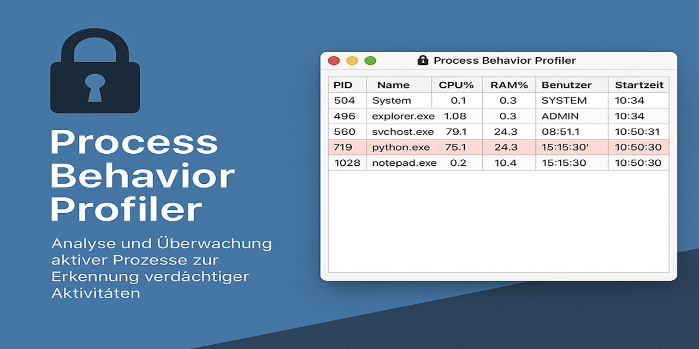

# 🔐 Process Behavior Profiler

||
|---|

**Process Behavior Profiler** is a local Python-based monitoring tool designed to analyze running processes in real time. It detects suspicious activities, high resource usage, and potential malware indicators — all while ensuring full data privacy with no cloud dependency.

---

## 🚀 Features

- 🔎 **Live Process Monitoring:** Real-time display of all active system processes
- 📊 **Resource Usage Detection:** Highlights processes with high CPU or memory load
- ⚠️ **Anomaly Flagging:** Detects potentially suspicious names (e.g. crypto, miner)
- 🔒 **Local-Only:** All analysis is performed entirely on your local machine
- 🧰 **Simple GUI:** Interactive interface with live updates every 5 seconds

---

## 📦 Installation

Make sure Python 3.10+ is installed on your system.

bash
pip install -r requirements.txt

---

## ▶️ Usage

Run the profiler using:

bash
python main.py

Once launched, it will:
- Display all processes in a table
- Highlight anomalies in red
- Update live every 5 seconds

---

## 🧱 Project Structure

process_behavior_profiler/
├── main.py           # Entry point
├── gui.py            # GUI and interface logic
├── monitor.py        # Data collection using psutil
├── detector.py       # Basic anomaly detection logic
├── requirements.txt  # Required Python libraries
└── README.md         # Project documentation

---

## 📌 Technologies

- Python 3
- psutil
- pandas
- tkinter (for GUI)

---

## 📜 License

MIT License – Free to use, modify, and distribute.

---

## 🛡 Security

This tool performs all processing **locally**. No data leaves your device.  
It is fully **privacy-compliant and GDPR-friendly**.
